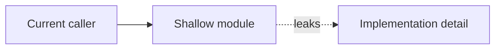
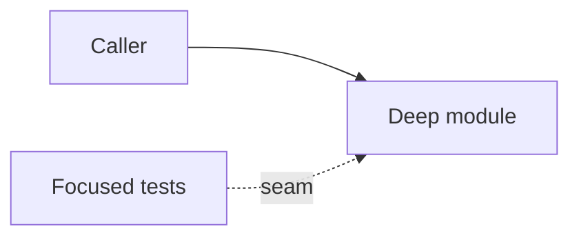

# Tech Debt Ticket Template

Use this template for one architecture review candidate. Copy it into
`docs/techdebt/YYYY-MM-DD-<candidate-slug>.md`.

````markdown
# <Candidate Title>

**Status:** proposed | accepted | implemented | rejected
**Review date:** YYYY-MM-DD
**Source report:** temp report path if still available; this ticket must include
enough copied context to stand alone
**Recommendation:** Strong | Worth exploring | Speculative
**Area:** workflow | skills | agents | finance | tests | docs
**Spec/milestone/doc anchor:** `docs/specs/...`, `docs/milestones/...`, or `docs/...`

## Problem

One or two sentences naming the architectural friction. Use the skill
vocabulary: `module`, `interface`, `implementation`, `deep`, `shallow`, `seam`,
`adapter`, `locality`, and `leverage`.

## Current Shape

- `<file-or-doc>`: current responsibility or leakage
- `<file-or-doc>`: current responsibility or leakage
- `<test_file.py>`: current test coupling or missing coverage

## Proposed Shape

Describe the deeper module or deletion/consolidation. Name the intended
interface, what implementation moves behind it, and which adapters or tests
should sit at the seam.

## Before



## After



## Expected Wins

- locality:
- leverage:
- tests:
- interface:

## Risks And Trade-offs

- 

## Acceptance Criteria

- [ ] The new or changed interface is documented in focused tests or an updated spec.
- [ ] Existing behavior remains covered by the relevant spec, milestone, or targeted tests.
- [ ] The old shallow path is removed or left with a clear reason.
- [ ] Any required workflow handoff is captured explicitly.
- [ ] `uv run pytest <focused slice>` passes for Python changes.
- [ ] `uv run ruff check .` passes for Python changes.

## Grilling Notes

Record settled answers from `grill-with-docs` here. Link an ADR only when the
decision is hard to reverse or surprising.

## Implementation Notes

Leave concise notes when the ticket moves to `implemented` or `rejected`.
````
