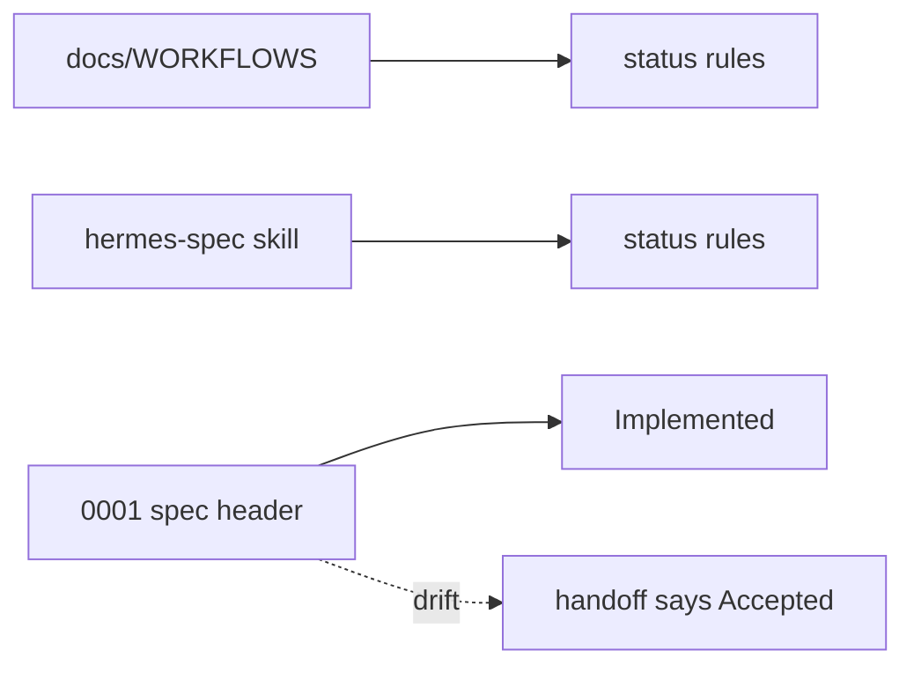
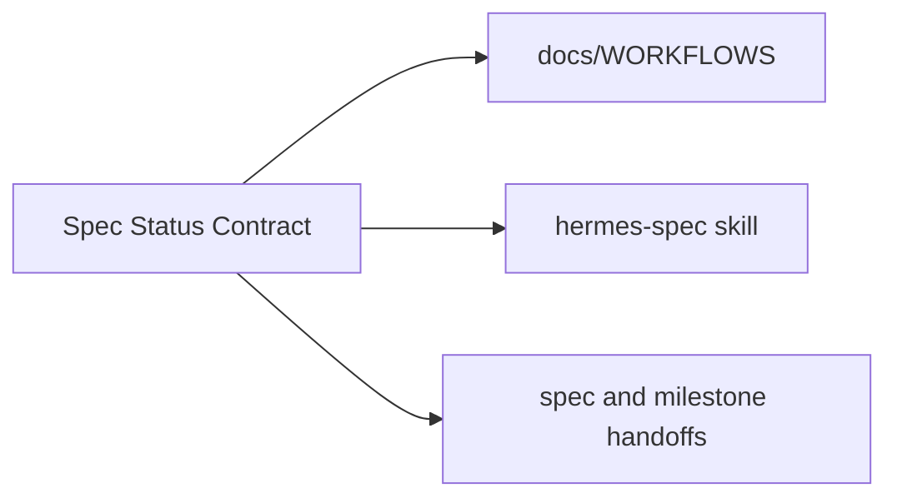

# Centralize spec status rules

**Status:** implemented
**Review date:** 2026-06-28
**Source report:** temp report path, if still available:
`/private/var/folders/ww/s0hkrfgs7mzcfw5wl8_g1v2m0000gn/T/hermes-agent-architecture-review-20260628-144652.html#centralize-spec-status-rules`.
This ticket includes enough copied context to stand alone.
**Recommendation:** Strong
**Area:** workflow
**Spec/milestone/doc anchor:** `docs/WORKFLOWS.md`

## Problem

Spec status was duplicated across workflow docs and skills, which made the
status interface shallow and allowed handoff language to drift away from spec
headers.

## Current Shape

- `docs/WORKFLOWS.md`: carried status definitions, but not as the clearly
  canonical contract
- `.agents/skills/hermes-spec/SKILL.md`: duplicated the same status rules
- `docs/specs/0001-finance-daily-market-brief.md`: header and handoff status
  had drifted apart

## Proposed Shape

Keep one canonical spec status contract in `docs/WORKFLOWS.md`. Skills should
reference that interface instead of restating it, and spec or milestone
handoffs should match their current header status.

## Before

## After

## Expected Wins

- locality: one status contract owns the meaning
- leverage: every spec and milestone reuses the same status language
- tests: drift becomes easier to review and catch
- interface: handoffs stop restating inconsistent rules

## Risks And Trade-offs

- Existing docs must be kept in sync when their current state changes.

## Acceptance Criteria

- [x] `docs/WORKFLOWS.md` is the canonical source for spec status language.
- [x] `.agents/skills/hermes-spec/SKILL.md` references the shared contract
  instead of duplicating it.
- [x] `0001` header and handoff status language agree with the implemented
  state.
- [x] Milestone handoff wording aligns with the same contract.

## Grilling Notes

Accepted in the review and completed in this doc-curator pass.

## Implementation Notes

Implemented by centralizing the status contract in `docs/WORKFLOWS.md`,
removing duplicated status definitions from `.agents/skills/hermes-spec`, and
aligning `0001` spec and milestone handoff wording.
