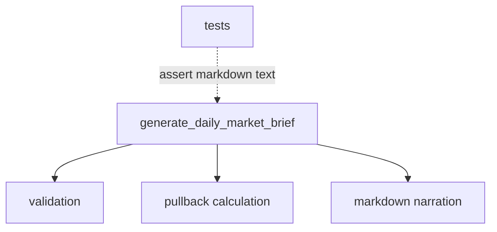
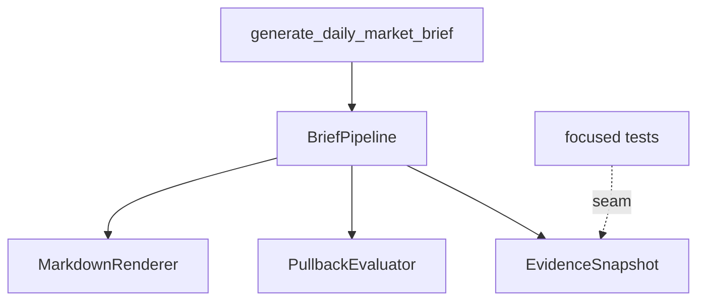

# Deepen finance brief evidence pipeline

**Status:** implemented
**Review date:** 2026-06-28
**Source report:** temp report path, if still available:
`/private/var/folders/ww/s0hkrfgs7mzcfw5wl8_g1v2m0000gn/T/architecture-review-20260628-144652.html#deepen-finance-brief-pipeline`.
This ticket includes enough copied context to stand alone.
**Recommendation:** Strong
**Area:** finance
**Spec/milestone/doc anchor:** `docs/specs/0001-finance-daily-market-brief.md`

## Problem

The current finance brief module exposes a shallow interface because fixture
validation, freshness checks, deterministic calculation, and markdown rendering
sit too close to callers and tests.

## Current Shape

- `src/hermes_finance/daily_market_brief.py`: public entry point and multiple
  internal responsibilities live together
- `tests/finance/test_daily_market_brief.py`: tests couple directly to markdown
  output
- `docs/specs/0001-finance-daily-market-brief.md`: stable callable exists, but
  no deeper evidence seam is named for follow-on work

## Proposed Shape

Keep `generate_daily_market_brief(...) -> str` as the public interface, but
move evidence shaping, deterministic calculation, and markdown rendering behind
a deeper internal pipeline seam that follow-on finance work can reuse.

## Before

## After

## Expected Wins

- locality: evidence and calculation rules live together
- leverage: later finance specs can build on a narrower internal interface
- tests: focused seams reduce markdown-only coupling
- interface: callers depend on one stable entry point

## Risks And Trade-offs

- The internal seams should stay private until a later accepted finance spec
  needs a broader public evidence interface.

## Acceptance Criteria

- [x] The accepted dev-loop scope defines the deeper pipeline boundary for this
  refactor.
- [x] `0002` or later finance work no longer needs to depend on markdown
  internals for pullback calculation behavior.
- [x] Focused tests cover the pullback calculation seam.
- [x] Existing `0001` behavior remains covered.

## Grilling Notes

Accepted in the review and completed in the paired finance implementation pass.

## Implementation Notes

Implemented by keeping `generate_daily_market_brief(...)` as the public facade,
moving orchestration into `BriefPipeline`, moving validation into
`EvidenceSnapshotValidator`, moving pullback calculation into
`PullbackEvaluator`, and moving report text into `MarkdownRenderer`.
