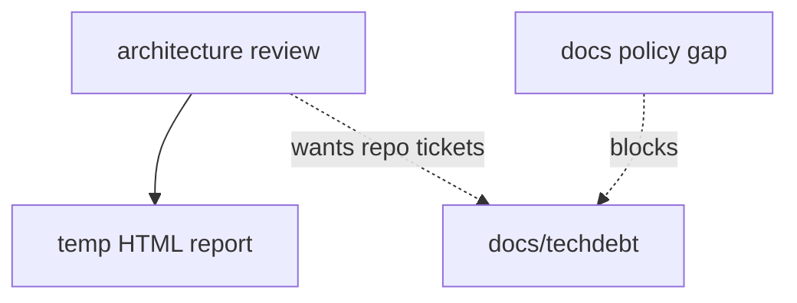
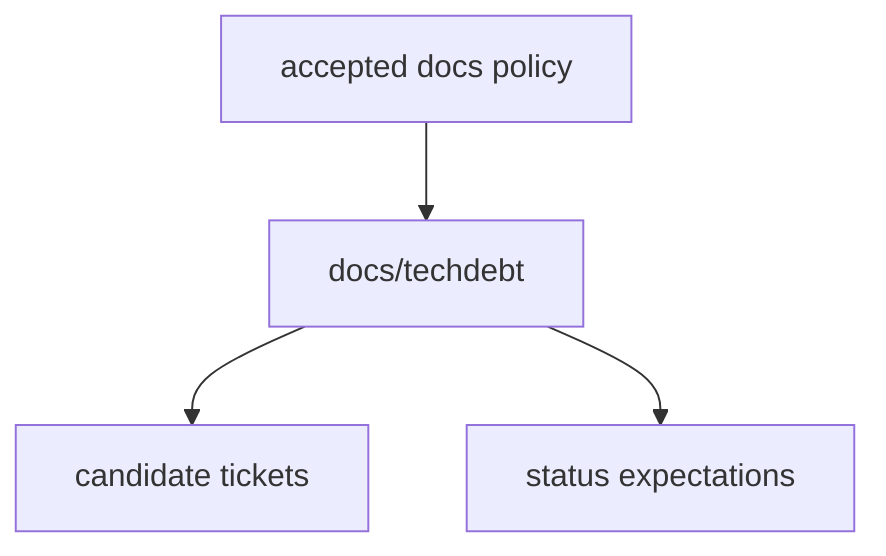

# Define architecture candidate destination

**Status:** implemented
**Review date:** 2026-06-28
**Source report:** temp report path, if still available:
`/private/var/folders/ww/s0hkrfgs7mzcfw5wl8_g1v2m0000gn/T/architecture-review-20260628-144652.html#define-architecture-candidate-destination`.
This ticket includes enough copied context to stand alone.
**Recommendation:** Worth exploring
**Area:** docs
**Spec/milestone/doc anchor:** `docs/DOCS_POLICY.md`

## Problem

Architecture reviews needed a durable ticket destination, but the docs
interface did not define where candidate tickets belonged or what statuses they
should use.

## Current Shape

- `docs/DOCS_POLICY.md`: canonical destinations omitted architecture candidate
  tickets
- `.agents/skills/improve-codebase-architecture/SKILL.md`: treated ticket
  creation as policy uncertainty
- `.agents/skills/improve-codebase-architecture/TECHDEBT-TICKET.md`: carried
  fallback language for an unaccepted destination

## Proposed Shape

Accept `docs/techdebt/` as the durable destination for architecture and
tech-debt candidate tickets, and define status expectations there.

## Before

## After

## Expected Wins

- locality: candidate tickets have one durable home
- leverage: every architecture review can emit the same artifact type
- tests: review passes can check policy alignment directly
- interface: report output and repo follow-up now match

## Risks And Trade-offs

- `docs/techdebt/` should stay concise so it does not become a second spec
  directory.

## Acceptance Criteria

- [x] `docs/DOCS_POLICY.md` names `docs/techdebt/` as an accepted destination.
- [x] Ownership and status expectations are documented there.
- [x] `improve-codebase-architecture` defaults to repo tickets under
  `docs/techdebt/`.
- [x] The ticket template no longer treats the destination as unresolved policy.

## Grilling Notes

Accepted in the review and completed in this doc-curator pass.

## Implementation Notes

Implemented by updating the docs policy, the architecture skill, the ticket
template, and by creating the initial ticket set under `docs/techdebt/`.
