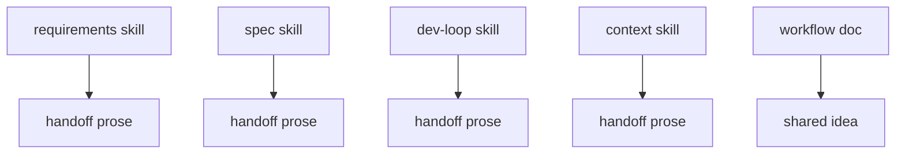
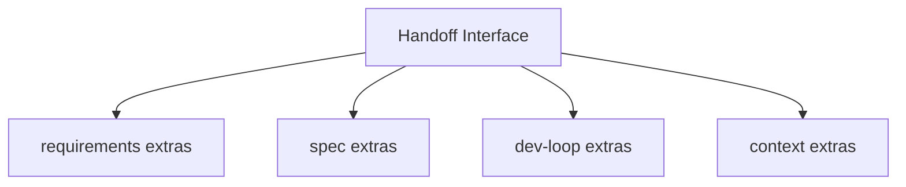

# Shrink skill handoff surface

**Status:** implemented
**Review date:** 2026-06-28
**Source report:** temp report path, if still available:
`/private/var/folders/ww/s0hkrfgs7mzcfw5wl8_g1v2m0000gn/T/hermes-agent-architecture-review-20260628-144652.html#shrink-skill-handoff-surface`.
This ticket includes enough copied context to stand alone.
**Recommendation:** Worth exploring
**Area:** skills
**Spec/milestone/doc anchor:** `docs/WORKFLOWS.md`

## Problem

Each Hermes skill repeated much of the handoff interface in local prose, which
made workflow changes shallow and forced synchronized edits across multiple
skill files.

## Current Shape

- `docs/WORKFLOWS.md`: already named a canonical handoff idea
- `.agents/skills/hermes-requirements/SKILL.md`: repeated shared output fields
- `.agents/skills/hermes-spec/SKILL.md`: repeated shared output fields
- `.agents/skills/hermes-dev-loop/SKILL.md`: repeated shared output fields
- `.agents/skills/hermes-context/SKILL.md`: repeated shared output fields

## Proposed Shape

Keep a shared handoff artifact interface and agent routing log contract in
`docs/WORKFLOWS.md`. Each skill should reference that shared interface and list
only its extra fields.

## Before

## After

## Expected Wins

- locality: shared workflow rules live in one place
- leverage: every Hermes skill inherits the same handoff contract
- tests: workflow review has a clearer seam
- interface: skill files focus on only their unique outputs

## Risks And Trade-offs

- Skill files still need small updates when the shared interface itself changes.

## Acceptance Criteria

- [x] `docs/WORKFLOWS.md` defines the shared handoff artifact fields.
- [x] `docs/WORKFLOWS.md` defines agent routing log expectations.
- [x] The four Hermes skill files reference the shared interface.
- [x] Each skill output section lists only skill-specific extra fields.

## Grilling Notes

Accepted in the review and completed in this doc-curator pass.

## Implementation Notes

Implemented by centralizing the handoff interface in `docs/WORKFLOWS.md` and
trimming repeated output field lists in the four Hermes skill files.
